# 도메인 발급 및 AWS ACM 설정
웹 및 애플리케이션 서비스를 www 인터넷 서비스로 제공 하려면 HTTPS 프로토콜 기반의 신뢰 할 수 있는 공인된 인증서(AWS ACM)를 필요로 합니다.

Public 도메인 발급 및 AWS Route53 의 구성과 ACM 을 적용하라면 아래와 같은 순서로 진행이 필요 합니다.
```
1. 도메인 공급 업체로부터 도메인을 등록 합니다.
2. AWS 관리 콘솔에 로그인하여 등록한 도메인 이름으로 Route53 의 public 호스트를 등록 합니다.
3. 도메인 공급 업체의 도메인 관리에서 Route53 에 등록한 호스트의 NS(nameserver) 정보를 등록 합니다.
4. AWS 관리 콘솔에서 등록한 도메인에 대해 ACM 인증서를 발급 받습니다. 
```

## 1. 도메인 등록
도메인 발급은 도메인 공급 업체로부터 등록이 가능하며 별도의 비용이 발생 합니다.  
대표적인 도메인 공급 업체는 아래와 같습니다. 
- [후이즈](https://domain.whois.co.kr/)
- [가비아](https://www.gabia.com/)
- [카페24](https://hosting.cafe24.com/)

한시적으로 이용할 수 있는 무료 도메인 발급이 가능한 [freenom.com](https://freenom.com) 에서 원하는 도메인을 발급 합시다.

### [freenom.com](https://freenom.com) 무료 도메인 발급 방법
1. 이용 가능한 도메인 검색    
본인이 원하는 도메인을 입력 하고 Check Availability 를 클릭 하세요.  
(예: 'simitsme.ml')
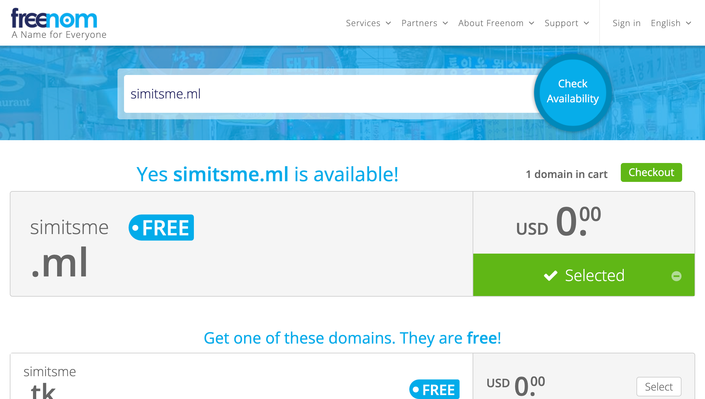
중복된 도메인이 없는 경우 위와 같이 Selected 버튼이 초록색으로 활성화 되며 우측 상단 'Checkout' 버튼을 클릭 할 수 있습니다.


2. Checkout
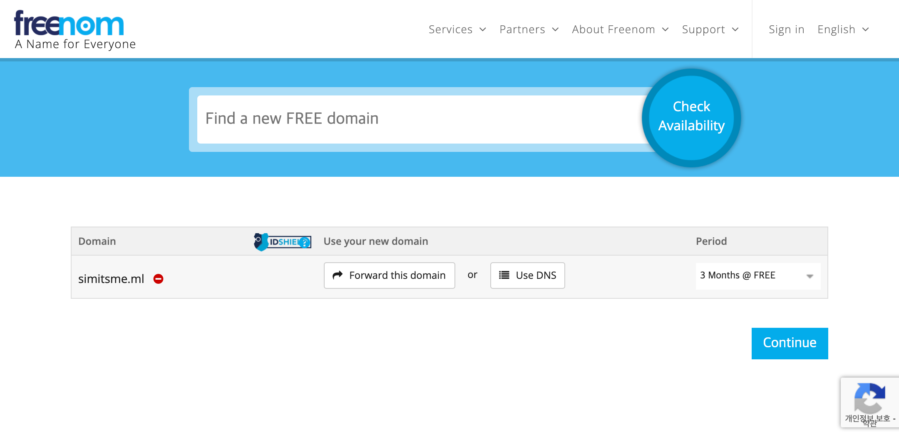 
Continue 를 클릭 합니다.


3. Verify Email
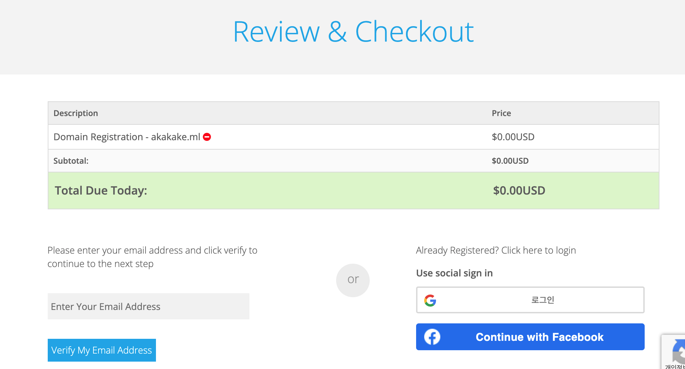
왼쪽 이메일 입력 항목에 본인의 이메일 주소를 입력 하고, 'Verify Email Address' 버튼을 클릭 합니다.
방금 입력한 본인의 이메일에 아래와 같인 freenom 으로부터 확인 링크가 제공 됩니다.
- 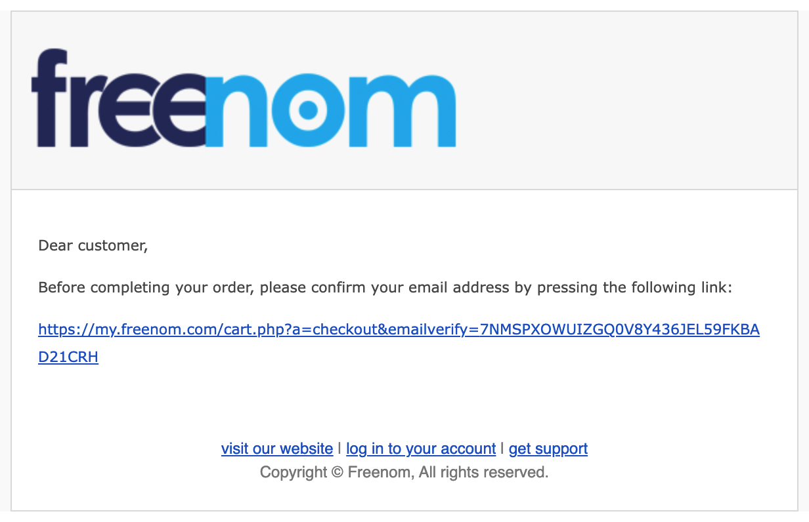


4. Sign Out & Order  
이메일이 확인되면 회원 가입 절차가 진행 됩니다.  
이름, 주소와 같은 필수 입력 항목을 입력 하고, 화면 하단의 약관 동의 체크후 'Complete Order' 클릭하여 주문을 완료 합니다.
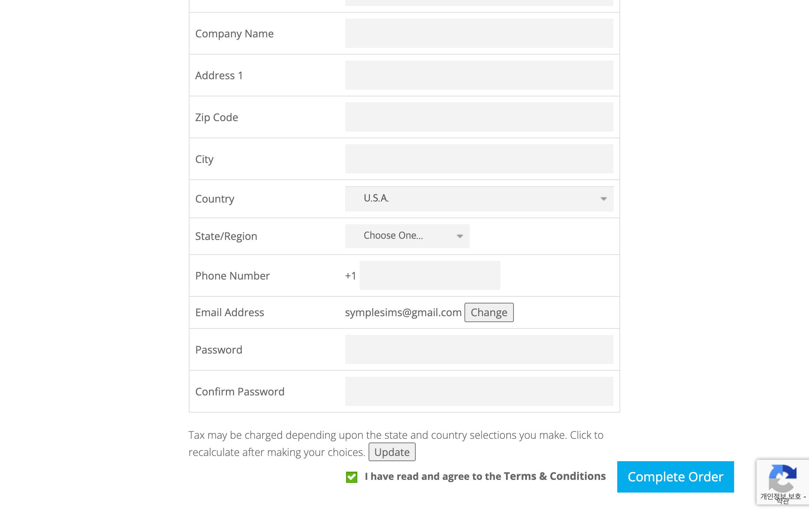 
아래와 같이 주문 번호를 확인 할 수 있습니다. 
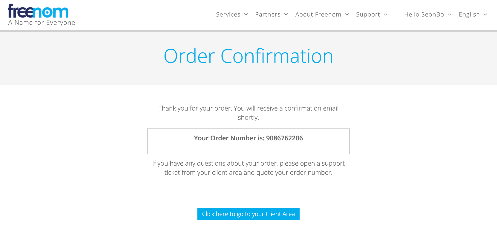


## 2. Route53 호스트 등록
1. AWS 관리 콘솔에 로그인 하여 Route 53 서비스에서 '호스팅 영역 생성' 을 클릭 합니다.
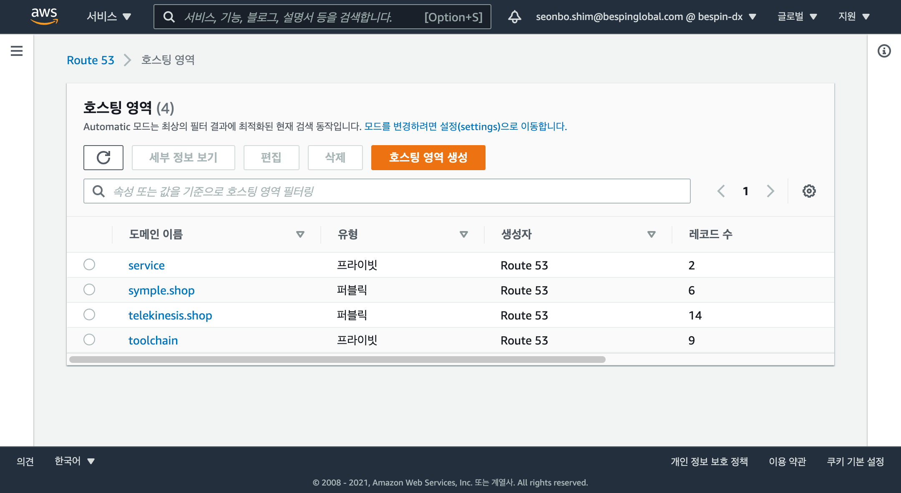


2. 도메인 공급 업체로부터 발급한 도메인 이름을 입력 합니다.
(예: 'simitsme.ml')
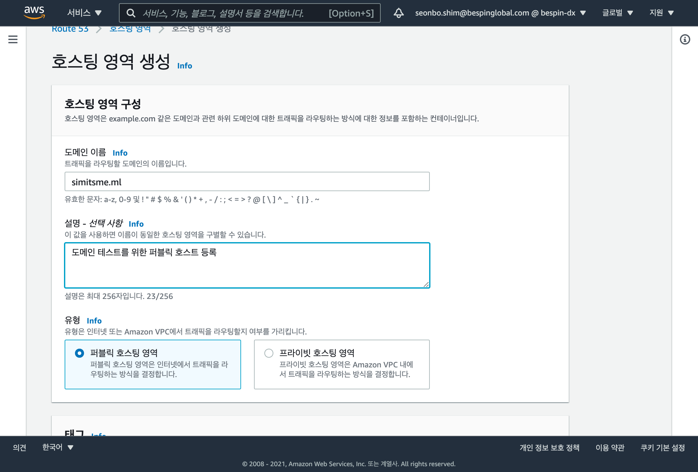
'퍼블릭 호스트 영력' 유형을 선택 하고 호스트 영역을 생성 합니다.


3. 생성된 Route53 호스트 정보는 아래와 같습니다.  
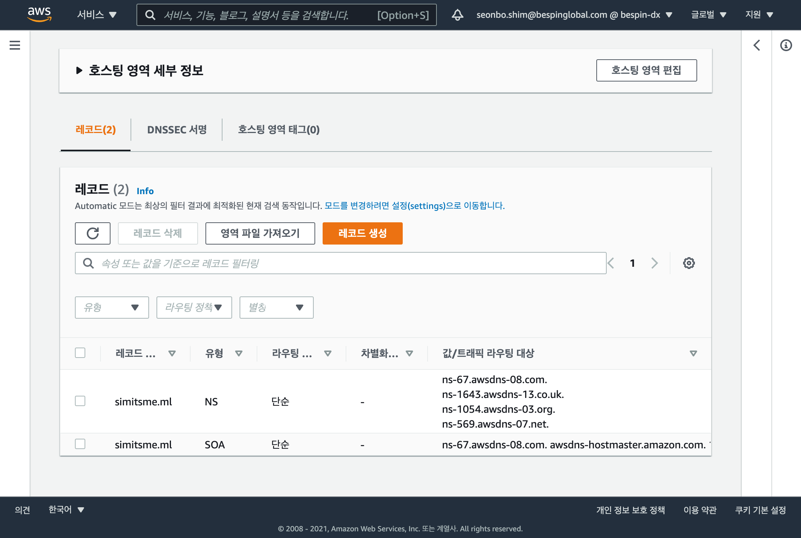
'simitsme.ml' 레코드를 확인 할 수 있으며, NS 유형을 통해 4개의 nameserver 값를 확인 할 수 있습니다.

## 3. 도메인 네임서버 정보 등록
도메인 공급 업체의 도메인 관리에서 Route 53 에서 발급 받은 4개의 nameserver 값을 등록 합니다.  
도메인 관리 화면은 공급 업체마다 차이가 있습니다. 우리는 [freenom.com](https://freenom.com) 를 통해 진행 합니다.

### [freenom.com](https://freenom.com) 네임서버 정보 등록
1. [freenom.com](https://freenom.com) 사이트에 로그인 하고 'Services > My Domains' 화면에 진입 하여 'Manage Domain' 을 선택 합니다.
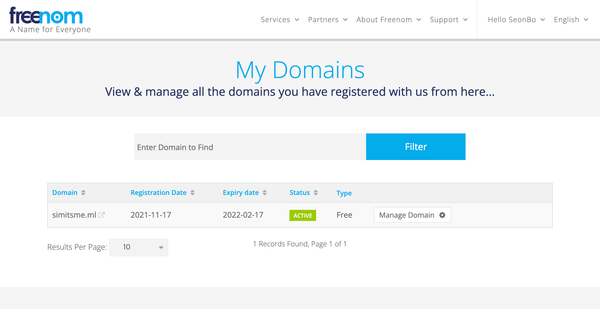


2. 화면 상단의 'Management Tools > Nameservers' 메뉴를 클릭 합니다. 
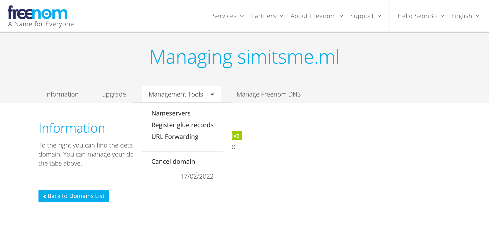


3. Use custom nameservers (enter below) 를 선택 하고, Route53 호스트에서 발급 받은 4개의 nameserver 값을 등록 합니다.
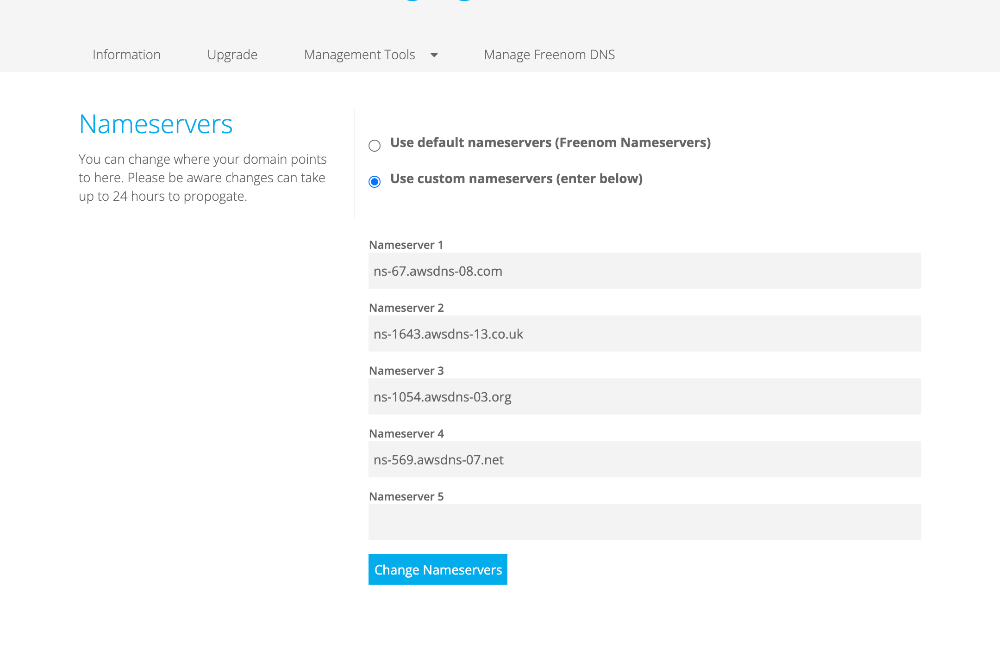
네임서버가 정상적으로 등록이 되면 nslookup 명령을 통해 확인이 가능 합니다.
- 확인 된 경우  
```
nslookup -type=ns simitsme.ml

Non-authoritative answer:
simitsme.ml	nameserver = ns-1643.awsdns-13.co.uk.
simitsme.ml	nameserver = ns-1054.awsdns-03.org.
simitsme.ml	nameserver = ns-67.awsdns-08.com.
simitsme.ml	nameserver = ns-569.awsdns-07.net.

Authoritative answers can be found from:
ns-67.awsdns-08.com	internet address = 205.251.192.67
ns-67.awsdns-08.com	has AAAA address 2600:9000:5300:4300::1
```

- 확인 되지 않은 경우 
```
nslookup -type=ns simitsme.ml

Server:		10.30.103.97
Address:	10.30.103.97#53

** server can't find simitsme.ml: NXDOMAIN
```

## 4. AWS ACM 인증서 발급
등록한 도메인에 대해 AWS Certificate Manager 인증서를 발급 합니다.
 
ACM(AWS Certificate Manager)을 통해 발급한 인증서로 TLS(HTTPS) 보안 프로토콜을 지원하며,
발급한 인증서는 EKS Ingress Controller(ALB)에서 사용 됩니다. 

1. ACM 인증서 발급 요청 
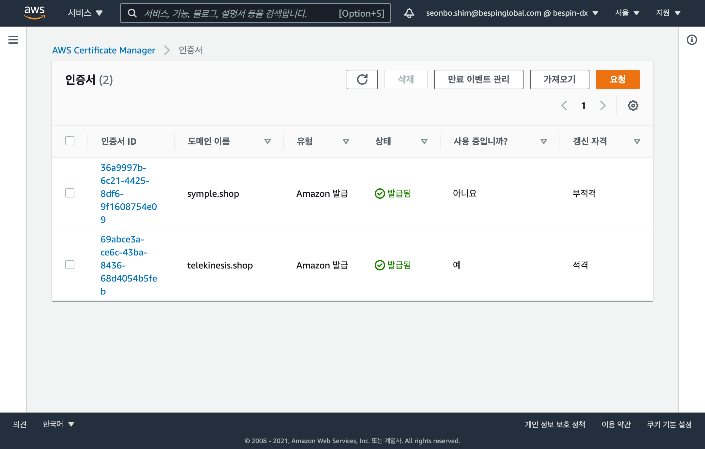
AWS 관리 콘솔에서 AWS Certificate Manager 인증서 서비스에 진입하고 상단의 '요청'을 통해 발급 할 수 있습니다.  


2. ACM 인증서 발급
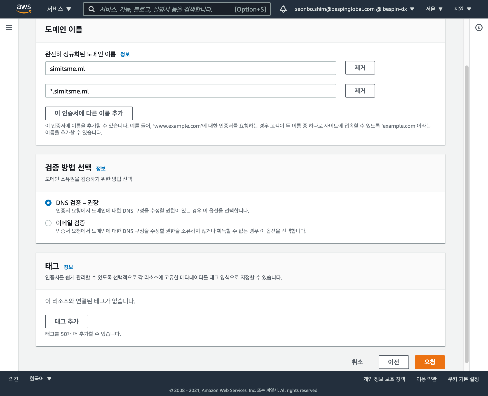
인증서에 등록한 도메인 이름을 입력 합니다. 특히 이 인증서에 다른 이름 추가 버튼을 클릭하여 3차 도메인도 같이 등록 합니다.
발급 받은 도메인이 'simitsme.ml' 인 경우 아래 두개의 도메인을 인증서에 추가 합니다. 
```
simitsme.ml
*.simitsme.ml
```
'DNS 검증 - 권장' 항목을 선택하고 하단의 요청 버튼을 클릭하여 발급 받습니다.


3. ACM 인증서 검증
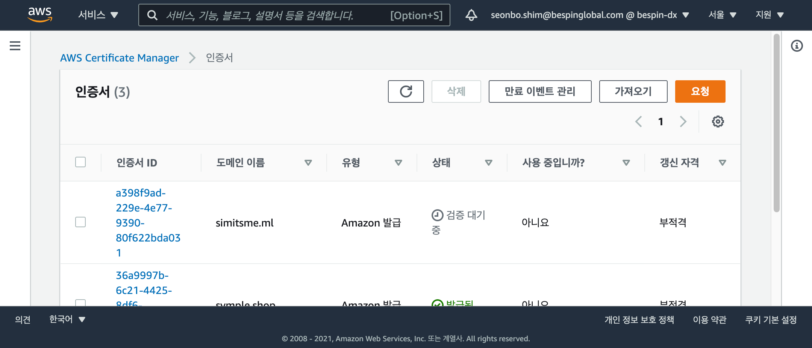
발급 받은 인증서 상태가 '검증 대기 중' 입니다


4. Route 53에서 레코드 생성  
'인증서 ID' 클릭 하여 'Route 53에서 레코드 생성' 버튼을 클릭 합니다.
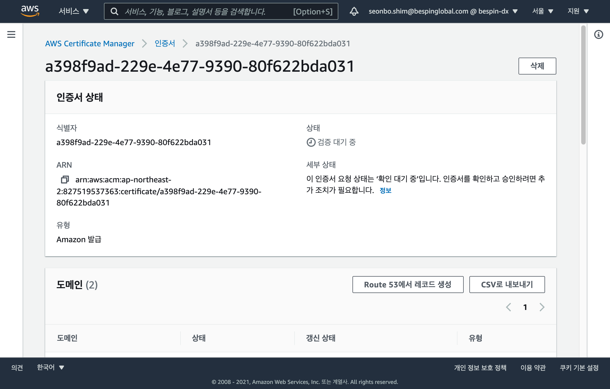

- 하단의 '레코드 생성' 버튼을 클릭 합니다.
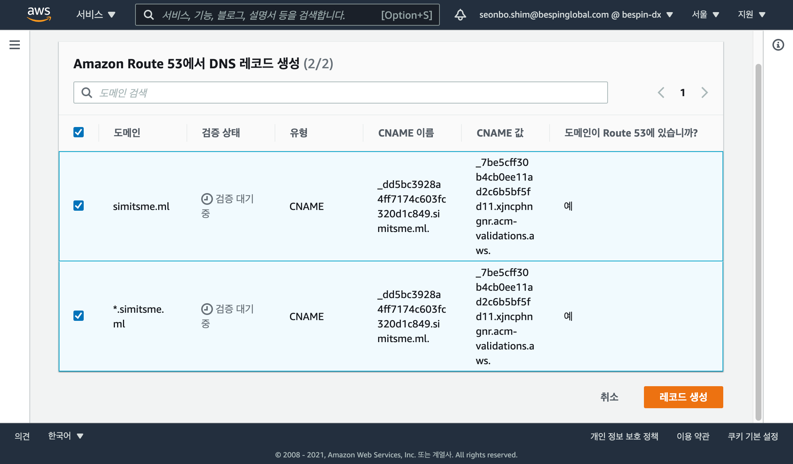

- Route 53에서 레코드 생성되면 얼마간 시간이 지나서 (약 30분 이내) 최종적으로 발급된 인증서 상태가 '발급됨' 으로 완료 됩니다. 
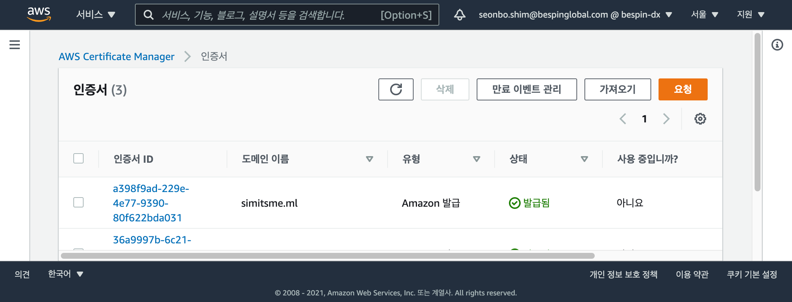

이렇게 발급된 인증서는 인터넷에 액세스되는 ALB 에 활용 됩니다.

