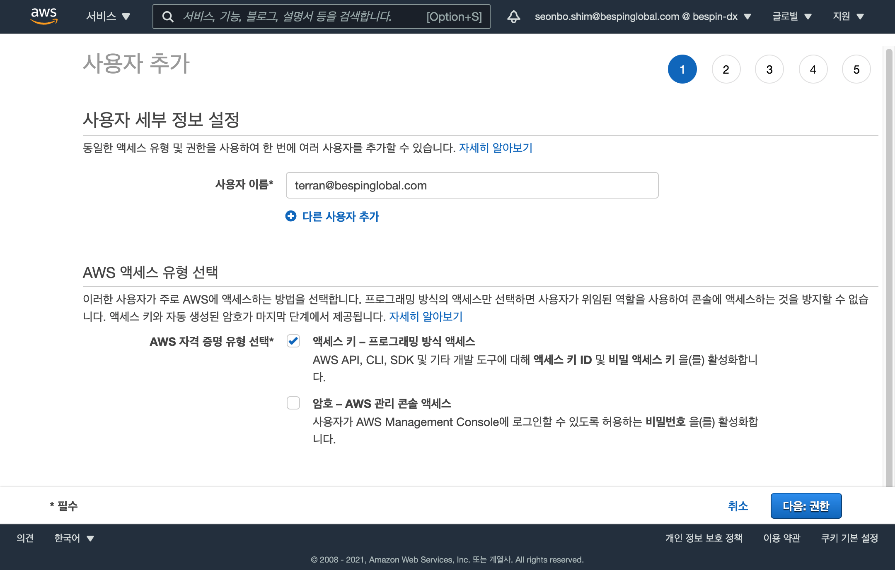

# AWS IAM 
AWS 클라우드 서비스를 생성 및 관리 하기 위한 사용자 어카운트을 생성 합니다.

## AWS 신규 사용자 추가
최초 AWS 관리 콘솔에 로그인 하는 계정은 ROOT 어카운트 입니다.  
ROOT 어카운트는 기본적으로 모든 권한이 부여된 계정이므로 보호된 액세스 정책을 기반으로 제한된 사용을 하여야 합니다.  
따라서 실습을 위한 신규 어카운트를 생성 하고 진행 하도록 합니다.

- "terran@bespinglobal.com" 신규 계정을 발급 합니다.
  

- 권한 설정 에서 '기존 정책 직접 연결'을 선택 하고 'AdministratorAccess' 를 선택 합니다.
  
- '다음: 태그', '다음: 검토' 단계를 거쳐  "사용자 만들기" 를 클릭하여 'terran@bespinglobal.com' 계정을 생성 합니다.

- AWS AccessKey 정보  
  최종적으로 아래와 같이 'terran@bespinglobal.com' 사용자 인증 정보인 AccessKey 를 제공 합니다.  
  AWS 자원을 액세스하기 위한 id/password 와 동일한 Credential 정보 이므로 유출되지 않도록 신중하게 관리 되어야 합니다.  
  특히 email, github, 웹하드 등 인터넷상에 업로드 되지 않도록 신중을 기하여 관리해 주세요, 실수로 노출되게되면 해커의 공격으로 비용폭탄을 경험하게 될 수 있습니다.
  


### AWS Profile 구성
로컬 PC 또는 AWS 클라우드의 Bastion 을 통해 구성할 수 있습니다.  
참고로, HandsOn 은 MacOS 또는 Ubuntu 환경에서 수월 합니다.

사용자 추가 이후에 제공 받은 AccessKey 정보로 Profile 정보를 구성 합니다.
- 'terran' AWS 프로파일 구성
```
aws configure --profile terran

AWS Access Key ID [None]: AKIAK*******
AWS Secret Access Key [None]: ********
Default region name [None]: ap-northeast-2
Default output format [None]: json
```
- AWS 프로파일은 사용자 홈 디렉토리 하위의 .aws 폴더에 관리 됩니다.
```
ls -al ~/.aws

total 16
drwxr-xr-x@  4 seonboshim  staff   128 11  3 12:48 .
drwxr-xr-x+ 58 seonboshim  staff  1856 11 17 11:47 ..
-rw-------@  1 seonboshim  staff   475  9 12 20:24 config
-rw-------@  1 seonboshim  staff  1842  9 12 20:24 credentials
```
위와 같이 config, credentials 두 개의 파일이 있습니다.

- AWS CLI 를 통한 액세스 확인
  아래와 같이 신규로 추가된 사용자가 정상적으로 조회되는것을 확인 할 수 있습니다.
```
aws iam list-users --query 'Users[].UserName' --profile terran

[
    "terran@bespinglobal.com",
]
```

- AWS OS 프로파일 환경 변수 추가  
  : MacOS 의 경우 ~/.zshrc  
  : Ubuntu 의 ~/.bashrc   
  OS 프로파일 환경 변수를 아래와 같이 추가 하고 저정 합니다.
```
export AWS_PROFILE=terran
export AWS_REGION=ap-northeast-2
```
AWS_PROFILE 및 AWS_REGION 환경 변수로 Default 프로파일이 적용 되면 '--profile terran' 옵션을 생략 하더라도 terran 으로 액세스 합니다.
```
aws iam list-users --query 'Users[].UserName'

[
    "terran@bespinglobal.com",
]
```
