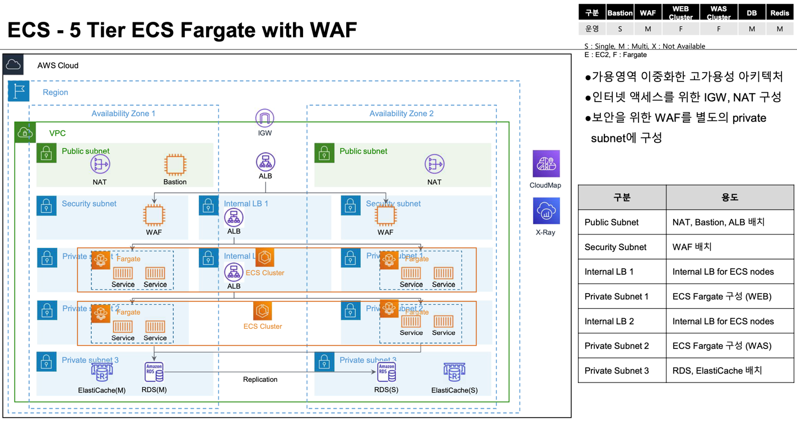

# 5 Tier 표준 ECS Fargate 클러스터 구성

5 Tier VPC 표준 아키텍처 위에 ECS Fargate 클러스터를 구성 합니다. 

## 아키텍처 



## 주요 리소스
 

## Code
- [vpc/main.tf](./vpc/main.tf) - tfmodule-aws-ecs 모듈을 임포트 하여 ECS Fargate 클러스터를 구성 합니다. 
 

## Build

```shell
git clone https://github.com/bsp-dx/terraform-hands-on.git
cd terraform-hands-on/samples/waf-5tier/ecs-fargate

terraform init
terraform plan
terraform apply
```

ECS Fargate 구성은 [tfmodule-aws-ecs](../../docs/tfmodule-aws-ecs.md) 테라폼 모듈을 참고 하세요.
----------
