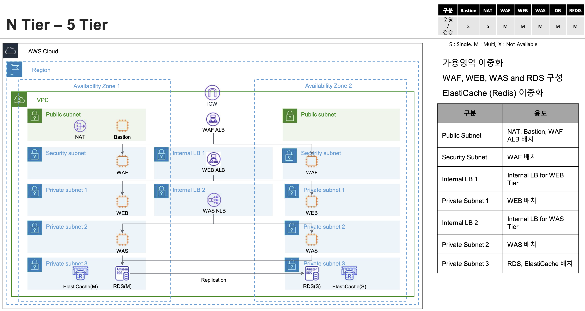

# 5 Tier 표준 VPC 아키텍처의 Load Balancer 배치 

5 Tier VPC 를 위한 Public ALB, Internal ALB, Internal NLB 를 배치 합니다. 

## 아키텍처 



### 서비스 시나리오는 아래와 같습니다.  
외부 클라이언트의 요청은 Domain - Route 53 을 통해 IGW 으로 진입 합니다. 
1. Public ALB 는 외부 클라이언트의 요청을 Security Subnet의 TargetGroup WAF 으로 전달 합니다.
2. TargetGroup WAF 에 배치된 3rd-party 방화벽 애플리케이션은 트래픽 감사를 하고, 정상이라면 UI Web 서비스로 전달 합니다.
3. UI Web 서비스 앞단에 배치된 Internal ALB 인 WEB-ALB 를 통해 TargetGroup WEB 으로 전달 합니다.
4. TargetGroup WEB 에 배치된 UI 용 애플리케이션은 Backend API 를 호출 합니다.
5. Backend API 전면에 배치된 Internal NLB 인 WAS-NLB 를 통해 서비스 port 에 대응 하는 endpoint 로 라우팅 합니다.  
 * WEB 애플리케이션 서비스 또는 RDS 데이터 베이스

## 주요 리소스

ALB 를 구성하는 주요 리소스는 다음과 같습니다.

|  Service          | Resource              |  Description |
| :-------------:   | :-------------        | :----------- |
| EC2               | ALB Public            | Internet facing 을 위한 ALB 를 Public 서브넷에 구성 합니다. |   
| EC2               | ALB WEB               | 애플리케이션 서비스 분산을 위한 Internal ALB 를 lbweb 서브넷에 구성 합니다. |   
| EC2               | NLB WAS               | 애플리케이션 서비스 분산을 위한 Internal NLB 를 lbwas 서브넷에 구성 합니다. |   
| EC2               | TargetGroup WAF       | 커스텀 웹 방화벽 애플리케이션이 배치 될 대상 그룹 "waf-tg80"을 구성 합니다. |   
| EC2               | TargetGroup WEB       | Frontend 웹 서비스용 애플리케이션이 배치 될 대상 그룹 "web-tg80"을 구성 합니다. |   
| EC2               | TargetGroup WAS       | Backend API 애플리케이션이 배치 될 대상 그룹 "was-tg8080"을 구성 합니다. |   
| EC2               | TargetGroup RDS       | AWS RDS(mysql) 서비스가 배치 될 대상 그룹 "rds-tg8080"을 구성 합니다. |   
| Route53           | Private Host Zone     | RDS 액세스를 위한 Private DNS 레코드를 구성 합니다. (data.<private_domain>) |   

그 외에도 로드밸런서 Listener 와 Routing Rule, 대상 그룹의 Health check 매트릭 등이 구성 됩니다. 


## Code
- [alb/data.tf](./alb/data.tf) - 로드 밸런서를 구성 하기 위한 VPC 및 서브 네트워크를 데이터 소스로 참조 합니다. 
- [alb/alb-pub.tf](./alb/alb-pub.tf) - Public ALB 를 구성 합니다. 
- [alb/alb-web.tf](./alb/alb-web.tf) - Internal ALB 를 구성 합니다.
- [alb/alb-web.tf](./alb/nlb-was.tf) - Internal NLB 를 구성 합니다.
- [alb/providers.tf](./alb/providers.tf) - Terraform 버전과 AWS 프로바이더를 정의 합니다. 
- [alb/variables.tf](./alb/variables.tf) - vpc_cidr 변수를 정의 합니다. 


## Build

[tfmodule-aws-alb](../../docs/tfmodule-aws-alb.md) 테라폼 모듈을 통해 로드 밸런서(ALB / NLB) 리소스를 Provisioning 합니다.

```shell
git clone https://github.com/bsp-dx/terraform-hands-on.git
cd samples/waf-vpc5tier/alb

terraform init
terraform plan
terraform apply
```

ALB 구성은 [tfmodule-aws-alb](../../docs/tfmodule-aws-alb.md) 테라폼 모듈을 참고 하세요.
----------
