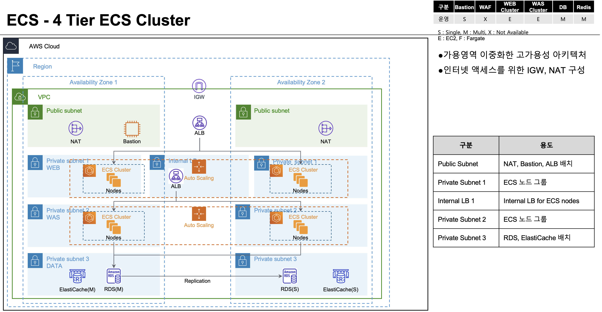

# 4 Tier ECS Cluster

4 Tier ECS Cluster 표준 아키텍처로 가용영역 및 WEB, WAS, RDS, ElastiCache 서비스 등이 이중화로 배치되어 안정적인 고-가용성 서비스 환경을 구성 합니다.

## 아키텍처



서비스 요청 흐름은 다음과 같습니다.
```
1. 인터넷 사용자 및 클라이언트는 WWW public 도메인을 통해 요청 합니다.
2. DNS 네임 서버를 식별하여 여러 단계(hop)을 거쳐 Route 53 을 찾습ㄴ다.
3. Route 53 은 host-zone 에 매핑된 타겟 Public ALB 으로 라우팅 합니다.
4. IGW 를 거쳐 Public ALB 로 전달 됩니다.
5. Public ALB 는 UI WEB 애플리케이션인 배치되어 있는 web-tg80 으로 전달 합니다.
   * web-tg80 은 ECS WEB 클러스터의 서비스와 연결 되어 있습니다.
6. web-tg80 에 배치된 UI 웹 애플리케이션은 WAS 애플리케이션에 전달 되며 중간에 배치된 Internal ALB 를 거치게 됩니다.
7. Internal ALB 는 서비스 포트에 해당하는 대상 그룹 (was-tg8080, ...) 에 전달 합니다.
8. WAS 애플리케이션은 RDS, ElasticCache 등의 서비스에 액세스 합니다.
```
* 대상 그룹은 애플리케이션 유형 및 목적에 맞게 다양하게 추가 할 수 있습니다.

__________

## 주요 구성 리소스 요약

### VPC

|  Service          | Resource              |  Description |
| :-------------:   | :-------------        | :----------- |
| VPC               | VPC                   | AWS VPC(프라이빗 클라우드)서비스를 구성 합니다. |   
| VPC               | Internet Gateway      | 인터넷 사용자(애플리케이션) vs VPC 내의 리소스(ELB, EC2, ...)간 통신을 위한 Internet Gateway 를 구성 합니다. |   
| VPC               | Nat Gateway           | VPC 내의 리소스(EC2, ..)에서 외부 인터넷 자원(github, docker.hub,...) 을 액세스 하기 위한 NAT 게이트웨이를 구성 합니다. |   
| VPC               | EIP                   | NAT 게이트웨이가 사용하는 EIP(Elastic IP) 를 구성 합니다.  |   
| VPC               | Public Subnet         | VPC 내의 Public 서브 네트워크를 구성 합니다. 인터넷 사용자(애플리케이션)과 직접적인 액세스가 가능 합니다. |   
| VPC               | WEB Private Subnet    | UI WEB 애플리케이션 서비스가 배치 될 Private 서브 네트워크를 구성 합니다. |   
| VPC               | WAS Private Subnet    | Backend WAS 애플리케이션 서비스가 배치 될 Private 서브 네트워크를 구성 합니다. |   
| VPC               | lbweb Private Subnet  | UI WEB 애플리케이션을 위한 로드 밸런서가 사용 할 Private 서브 네트워크를 구성 합니다. |   
| VPC               | Routing Tables        | VPC 내의 public 및 private 서브 네트워크의 서로 다른 IP 대역들에 대해 액세스 연결을 위한 라우팅 경로를 설정 합니다. |   
| VPC               | Security Group        | VPC 를 위한 기본 security_group 을 구성 합니다. |

* web 을 위한 별도의 로드 밸런서용 lbweb Private Subnet 을 두는 이유는 한정된 Private-IP 로 인해 로드 밸런서가 부하에 대응하여 확장되지 못하는 위험을 사전에 방지하기 위함 입니다.

### EC2
|  Service          | Resource              |  Description |
| :-------------:   | :-------------        | :----------- |
| EC2               | ALB Public            | Internet facing 을 위한 ALB 를 Public 서브넷에 구성 합니다. |
| EC2               | ALB WEB               | 애플리케이션 서비스 분산을 위한 Internal ALB 를 lbweb 서브넷에 구성 합니다. |
| EC2               | TargetGroup WEB       | UI WEB 애플리케이션이 배치 될 대상 그룹 "web-tg80"을 구성 합니다. |
| EC2               | TargetGroup WAS       | Backend WAS 애플리케이션이 배치 될 대상 그룹 "was-tg8080"을 구성 합니다. |
| EC2               | LaunchTemplate        | - |
| EC2               | Auto-Scaling Group    | - |

그 외에도 로드밸런서 Listener 와 Routing Rule, Target Group 및 Health Check 매트릭 등이 구성 됩니다.


### ECS

|  Service          | Resource              |  Description |
| :-------------:   | :-------------        | :----------- |
| ECS               | ECS                   | ECS EC2 클러스터를 생성 합니다. |
| ECS               | Capacity-Provider     | 용량 프로바이더 |
| ECS               | Capacity-Provider     | 용량 프로바이더 |


### Public ALB
Public ALB 의 이름은 pub 라로 정의 하고 `pub` 서브넷과 연결 되어야 합니다.  
Public ALB를 위한 전용 보안 그룹을 생성 합니다.  
유입되는 정상적인 트래픽은 web-80tg 대상 그룹으로 전달 합니다.


### Internal ALB - WEB
Internal ALB 의 이름은 web 으로 정의 하고 `lbweb` 서브넷과 연결 되어야 합니다.  
유입되는 네트워크 트래픽은 was-8080tg, was-8088tg 대상 그룹으로 각각 전달 합니다.
Internal ALB를 위한 전용 보안 그룹을 생성 합니다.


__________

## Build
4 Tier ECS  표준 아키텍처는 VPC 및 ECS 등의 서비스들을 한번에 하나씩 단계적으로 Stack 을 올리듯이 서비스를 구성 합니다.

### Checkout
git clone 명령으로 프로젝트를 체크 아웃 합니다.

```
git clone https://github.com/bsp-dx/terraform-hands-on.git
```

### 프로젝트 환경 변수 설정
WAF_PROJECT_HOME 프로젝트 홈 경로를 위한 환경 변수를 설정 합니다.

```
export WAF_PROJECT_HOME=$(pwd -P)/terraform-hands-on/waf-templates/4-tier-ecs
```

### ECS EC2
[ecs-ec/main.tf](ecs-fargate/main.tf) 코드를 메인으로 ECS Fargate 관련 전체 서비스를 한번에 구성 합니다.

```shell

cd ${WAF_PROJECT_HOME}/ecs-fargate

terraform init
terraform plan
terraform apply
```

## Destroy
ECS Fargate 관련 전체 서비스가 한번에 모두 제거 됩니다. 

```
cd ${WAF_PROJECT_HOME}/ecs-fargate

terraform destroy
``` 

__________


## References
4 Tier ECS 서비스 구성에 필요한 테라폼 자동화 모듈은 다음과 같습니다.

- [Context](../../docs/tfmodule-context.md) 테라폼 모듈 가이드
- [VPC](../../docs/tfmodule-aws-vpc.md) 테라폼 모듈 가이드
- [ALB](../../docs/tfmodule-aws-alb.md) 로드밸런서 테라폼 모듈 가이드
- [ECS](../../docs/tfmodule-aws-ecs.md) EC2 컨테이너 클러스터 테라폼 모듈 가이드
- [Amazon Workshop Cats & Dogs ECS](https://ecs-cats-dogs.workshop.aws/ko/ecs.html) 레퍼런스 가이드 
- [Amazon Workshop Deploy Microservices to ECS](https://ecsworkshop.com/microservices/) 레퍼런스 가이드
  