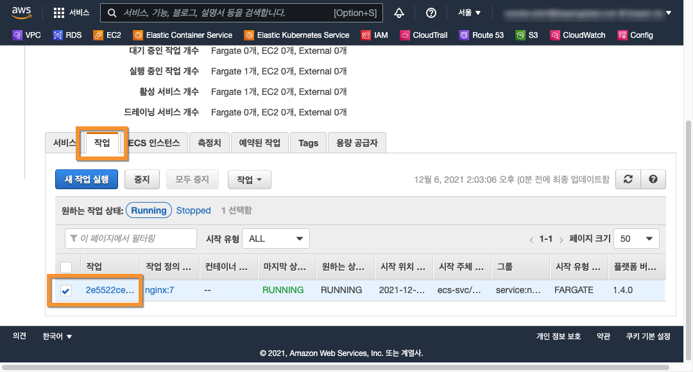

# 사용자 애플리케이션을 ECS 클러스터에 배포

ECS 클러스터에 사용자 애플리케이션을 론칭(배포)을 합니다.

배포할 사용자 애플리케이션은 ECS 작업 정의로 사전에 구성 되어 있어야 하며 **[ecs-tasks](../ecs-tasks/ecs-tasks.md)** 를 참조 하세요.

## Build

5 Tier ECS Fargate 클러스터에 nginx-service 를 빌드 및 배포 합니다.

### Checkout

git clone 명령으로 프로젝트를 체크 아웃 합니다.

```
git clone https://github.com/bsp-dx/terraform-hands-on.git
```

### 프로젝트 환경 변수 설정

WAF_PROJECT_HOME 프로젝트 홈 경로를 위한 환경 변수를 설정 합니다.

```
export WAF_PROJECT_HOME=$(pwd -P)/terraform-hands-on/waf-templates/5-tier-ecs-fargate/nginx-service
```

### Nginx ECS Service

[nginx-service/main.tf](nginx-service/main.tf) 코드를 메인으로 nginx service 를 론칭 합니다.

```shell
cd ${WAF_PROJECT_HOME}

terraform init
terraform plan
terraform apply
```

### Nginx ECS Service 참조 데이터 소스

nginx service 가 론칭 되려면 ECS 클러스터, VPC 와 서브넷, ALB 대상 그룹 및 보단 그룹 등을 참조 하여야 합니다.

- nginx-service 를 위한 데이터 소스 참조 : [nginx-service/data.tf](nginx-service/data.tf)

| Resource | Name | Description | Example | 
| ---- | ----------- | ------- | ------- |
| aws_vpc | this | VPC 데이터 소스를 참조 합니다. | data.aws_vpc.this.id |
| aws_subnet_ids | web | 서브넷 아이디 데이터 소스를 참조 합니다. | data.aws_subnet_ids.web.ids | 
| aws_alb_target_group | web | ALB 대상 그룹 데이터 소스를 참조 합니다. | data.aws_alb_target_group.web.arn | 
| aws_security_group | web | 보안 그룹 데이터 소스를 참조 합니다. | data.aws_security_group.web.id |
| aws_ecs_cluster | web | ECS 클러스터 데이터 소스를 참조 합니다. | data.aws_ecs_cluster.ecs_web.cluster_name |
| aws_ecs_task_definition | nginx | ECS 작업 정의 데이터소스를 참조 합니다. | data.aws_ecs_task_definition.nginx.id |

## Destroy

nginx-service 를 삭제 합니다.

```shell
cd ${WAF_PROJECT_HOME}

terraform destroy
```

nginx service 를 제거하려면 terraform destroy 이후에 Task(nginx 컨테이너 서비스) 를 중지하여야 합니다.

```
1. terraform destroy 명령어로 제거를 진행 합니다. 
2. AWS 관리 콘솔에 로그인 > Elastic Container Service 메뉴에 진입 하고
3. nginx-service 가 배포된 ECS 클러스터를 클릭 합니다.
4. 작업 (Task) 탭 메뉴를 클릭 합니다.
5. 서비스 '그룹'이 "service:nginx-service" 인 항목을 선택하고 "중지" 버튼을 클릭하여 중지 시킵니다.
```


