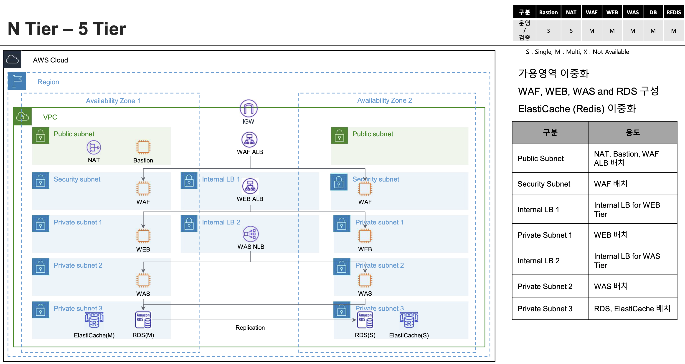

# 5 Tier VPC with WAF

5 Tier VPC 표준 아키텍처로 가용영역 및 3rd-party WAF, WEB, WAS, RDS, ElastiCache 이중화로 설계된 표준 VPC 아키텍처를 구성 합니다.

## 아키텍처



서비스 요청 흐름은 다음과 같습니다.
```
1. 인터넷 사용자 및 클라이언트는 WWW public 도메인을 통해 요청 합니다.
2. DNS 네임 서버를 식별하여 여러 단계(hop)을 거쳐 Route 53 을 찾습ㄴ다.
3. Route 53 은 host-zone 에 매핑된 타겟 Public ALB 으로 라우팅 합니다.
4. IGW 를 거쳐 Public ALB 로 전달 됩니다.
5. Public ALB 는 3rd-part 웹 방화벽 애플리케이션인 배치되어 있는 waf-tg80 으로 전달 합니다.
6. 웹 방화벽 애플리케이션은 패킷을 감사하고 정상 적인 요청이라면 HTTP(s) Proxy 기반의 라우팅(포워딩 또는 리다이렉트) 합니다.
7. HTTP URI 등으로 라우팅 된 목적지는 대게 UI 를 담당하는 WEB 애플리케이션으로 전달 되며 중간에 배치된 Internal ALB 를 거치게 됩니다.
8. Internal ALB 는 Port 및 라우팅 룰에 해당 하는 대상 그룹 web-tg80 로 전달 됩니다.
9. web-tg80 에 배치된 UI 역할의 웹 애플리케이션들이 API 로 연결된 Backend 애플리케이션 에 전달 되며 중간에 배치된 Internal NLB 를 거치게 됩니다.
10. Internal NLB 는 서비스 포트에 해당하는 대상 그룹 (was-tg8080, ...) 에 전달 합니다.
11. Backend API 애플리케이션은 중간의 NLB 를 거치며 서비스 포트에 해당하는 RDS, EC 등의 서비스에 액세스 하게 됩니다.
```
* 대상 그룹은 애플리케이션 유형 및 목적에 맞게 다양하게 추가 할 수 있습니다.

__________

## 주요 구성 리소스 요약

### VPC

|  Service          | Resource              |  Description |
| :-------------:   | :-------------        | :----------- |
| VPC               | VPC                   | AWS VPC(프라이빗 클라우드)서비스를 구성 합니다. |   
| VPC               | Internet Gateway      | 인터넷 사용자(애플리케이션) vs VPC 내의 리소스(ELB, EC2, ...)간 통신을 위한 Internet Gateway 를 구성 합니다. |   
| VPC               | Nat Gateway           | VPC 내의 리소스(EC2, ..)에서 외부 인터넷 자원(github, docker.hub,...) 을 액세스 하기 위한 NAT 게이트웨이를 구성 합니다. |   
| VPC               | EIP                   | NAT 게이트웨이가 사용하는 EIP(Elastic IP) 를 구성 합니다.  |   
| VPC               | Public Subnet         | VPC 내의 Public 서브 네트워크를 구성 합니다. 인터넷 사용자(애플리케이션)과 직접적인 액세스가 가능 합니다. |   
| VPC               | Private Subnet        | Private 서브 네트워크를 구성 합니다. |   
| VPC               | WAF Private Subnet    | 커스텀 웹 방화벽 애플리케이션 이 배치 될 Private 서브 네트워크를 구성 합니다. |   
| VPC               | WEB Private Subnet    | UI를 담당하는 WEB 애플리케이션 서비스가 배치 될 Private 서브 네트워크를 구성 합니다. |   
| VPC               | API Private Subnet    | Backend API 애플리케이션 서비스가 배치 될 Private 서브 네트워크를 구성 합니다. |   
| VPC               | lbweb Private Subnet  | UI WEB 애플리케이션을 위한 로드 밸런서가 사용 할 Private 서브 네트워크를 구성 합니다. |   
| VPC               | lbwas Private Subnet  | Backend API 애플리케이션을 위한 로드 밸런서가 사용 할 Private 서브 네트워크를 구성 합니다. |   
| VPC               | Private Subnet WAF    | 커스텀 웹 방화벽 애플리케이션 이 배치될 Private 서브 네트워크를 구성 합니다. |   
| VPC               | Routing Tables        | VPC 내의 public 및 private 서브 네트워크의 서로 다른 IP 대역들에 대해 액세스 연결을 위한 라우팅 경로를 설정 합니다. |   
| VPC               | Security Group        | VPC 를 위한 기본 security_group 을 구성 합니다. |

* web 및 api 를 위한 별도의 로드 밸런서용 Sub-network 를 두는 이유는 한정된 Private-IP 로 인해 로드 밸런서가 부하에 대응하여 확장되지 못하는 위험을 사전에 방지하기 위함 입니다.

### ALB

|  Service          | Resource              |  Description |
| :-------------:   | :-------------        | :----------- |
| EC2               | ALB Public            | Internet facing 을 위한 ALB 를 Public 서브넷에 구성 합니다. |
| EC2               | ALB WEB               | 애플리케이션 서비스 분산을 위한 Internal ALB 를 lbweb 서브넷에 구성 합니다. |
| EC2               | NLB WAS               | 애플리케이션 서비스 분산을 위한 Internal NLB 를 lbwas 서브넷에 구성 합니다. |
| EC2               | TargetGroup WAF       | 커스텀 웹 방화벽 애플리케이션이 배치 될 대상 그룹 "waf-tg80"을 구성 합니다. |
| EC2               | TargetGroup WEB       | Frontend 웹 서비스용 애플리케이션이 배치 될 대상 그룹 "web-tg80"을 구성 합니다. |
| EC2               | TargetGroup WAS       | Backend API 애플리케이션이 배치 될 대상 그룹 "was-tg8080"을 구성 합니다. |
| EC2               | TargetGroup RDS       | AWS RDS(mysql) 서비스가 배치 될 대상 그룹 "rds-tg8080"을 구성 합니다. |
| Route53           | Public Host Zone      | nginx 애플리케이션 액세스를 위한 Public DNS 레코드를 구성 합니다. (nginx.<domain>) |

그 외에도 로드밸런서 Listener 와 Routing Rule, Target Group 및 Health Check 매트릭 등이 구성 됩니다.

### Public ALB
Public ALB 의 이름은 waf 라로 정의 하고 `pub` 서브넷과 연결 되어야 합니다.  
Public ALB를 위한 전용 보안 그룹을 생성 합니다.  
유입되는 정상적인 트래픽은 web-80tg 대상 그룹으로 전달 합니다.


### Internal ALB
Internal ALB 의 이름은 web 으로 정의 하고 `lbweb` 서브넷과 연결 되어야 합니다.  
유입되는 네트워크 트래픽은 web-80tg 대상 그룹으로 전달 합니다.
Internal ALB를 위한 전용 보안 그룹을 생성 합니다.


### Internal NLB
Internal NLB 의 이름은 was 로 정의 하고 `lbwas` 서브넷과 연결 되어야 합니다.  
네트워크 트래픽 중 8080 포트는로 유입되는 데이터는 was-8080tg 대상 그룹으로, 3306 포트로 유입되는 데이터는 rds-3306 대상 그룹으로 각각 전달 합니다.

__________

## Build
5 Tier VPC 표준 아키텍처를 VPC 를 시작으로 Stack 을 쌓는것과 같이 주요 리소스를 차례 대로 구성 합니다.

리소스 모듈간의 의존 관계가 있으므로 다음의 순서를 지켜서 빌드 합니다.  

### 프로젝트 체크 아웃 및 환경 변수 설정
```

git clone https://github.com/bsp-dx/terraform-hands-on.git

export WAF_PROJECT_HOME=$(pwd -P)/terraform-hands-on/waf-templates/5-tier-vpc-waf
```

### 1. VPC
[vpc/main.tf](vpc/main.tf) 코드를 메인으로 VPC 서비스를 구성 합니다.

```shell

cd ${WAF_PROJECT_HOME}/vpc

terraform init
terraform plan
terraform apply
```

### 2. Public ALB
[alb-waf/main.tf](alb-waf/main.tf) 코드를 메인으로 Public ALB 를 구성 합니다.

```
cd ${WAF_PROJECT_HOME}/alb-waf

terraform init
terraform plan
terraform apply
```

### 3. Internal ALB
[alb-web/main.tf](alb-web/main.tf) 코드를 메인으로 Internal ALB 를 구성 합니다.

```
cd ${WAF_PROJECT_HOME}/alb-web

terraform init
terraform plan
terraform apply
```

### 3. Internal NLB
[nlb-was/main.tf](nlb-was/main.tf) 코드를 메인으로 Internal ALB 를 구성 합니다.

```
cd ${WAF_PROJECT_HOME}/nlb-was

terraform init
terraform plan
terraform apply
```

__________


## Destroy
리소스 및 서비스 제거는 빌드의 역순으로 차례대로 진행 합니다. 

- Internal NLB 제거
```
cd ${WAF_PROJECT_HOME}/nlb-was

terraform destroy
```

- Internal ALB 제거
```
cd ${WAF_PROJECT_HOME}/alb-wes

terraform destroy
``` 

- Public ALB 제거
```
cd ${WAF_PROJECT_HOME}/alb-waf

terraform destroy
``` 

- Public VPC 제거
```
cd ${WAF_PROJECT_HOME}/vpc

terraform destroy
``` 

__________


## References
5 Tier VPC 서비스 구성에 필요한 테라폼 자동화 모듈은 다음과 같습니다. 

- [Context](../../docs/tfmodule-context.md) 테라폼 모듈 가이드 
- [VPC](../../docs/tfmodule-aws-vpc.md) 테라폼 모듈 가이드
- [ALB](../../docs/tfmodule-aws-alb.md) 테라폼 모듈 가이드

