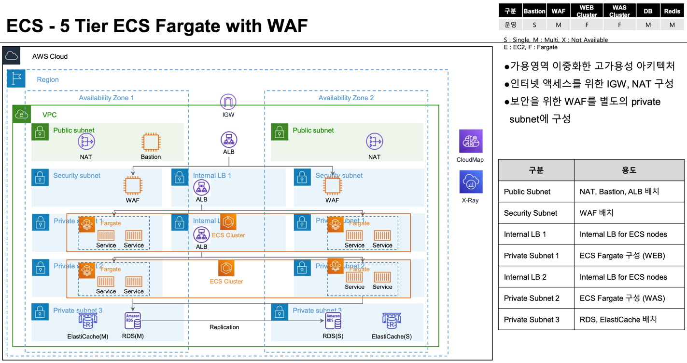

# 5 Tier 표준 ECS Fargate 클러스터 구성

5 Tier VPC 표준 아키텍처 위에 ECS Fargate 클러스터를 구성 합니다.   

## 아키텍처 



## 주요 리소스
ECS Fargate 클러스터를 구성하는 주요 리소스는 다음과 같습니다.

|  Service          | Resource              |  Description |
| :-------------:   | :-------------        | :----------- |
| ECS               | Fargate Core          | ECS Fargate 클러스터를 구성 합니다. |   
| ECS               | ECS Service           | nginx-service 애플리케이션 서비스를 구성 합니다. |   

### nginx-service 애플리케이션 서비스는 다음의 리소스에 의존 합니다.

- "nginx" ECS 작업 정의
- WAF Public ALB 보안 그룹
- WAF 타겟 그룹
- WEB Security Subnet
- ECS 클러스터를 위한 IAM 서비스 연결 역할 "AWSServiceRoleForECS"

 
## ECS Fargate 클러스터
ECS Fargate 클러스터 구성 자체는 AWS Region 만 있으면 되며, VPC 에 종속적이지 않습니다.

## Code
- [ecs-fargate/main.tf](ecs-fargate/main.tf) - tfmodule-aws-ecs 모듈을 임포트 하여 ECS Fargate 클러스터를 구성 합니다.
- [ecs-fargate/nginx-service.tf](ecs-fargate/nginx-service.tf) - nginx-service 애플리케이션을 시작 합니다. 
- [ecs-fargate/data.tf](ecs-fargate/data.tf) - nginx-service 애플리케이션 구성에 필요한 데이터소스를 참조 합니다.

## Build ECS Fargate

```shell
git clone https://github.com/bsp-dx/terraform-hands-on.git
cd terraform-hands-on/waf-templates/5-tier-vpc-waf/ecs-fargate

terraform init
terraform plan
terraform apply
```

ECS Fargate 구성은 [tfmodule-aws-ecs](../../docs/tfmodule-aws-ecs.md) 테라폼 모듈을 참고 하세요.
----------
